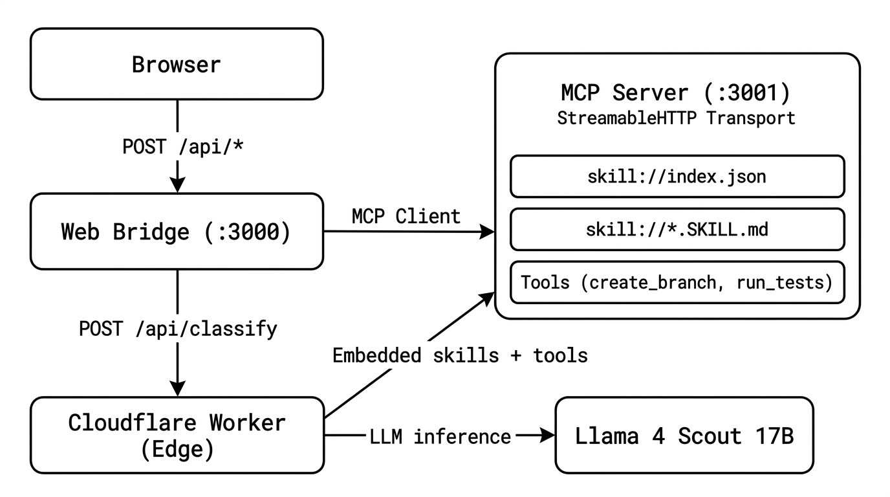

# skills-over-mcp

Skills over MCP: agent workflows as standard MCP resources with a `skill://` URI scheme.

```bash
npm install
```

## Quick start

```bash
# Start the MCP server (port 3001) and web UI (port 3000)
npm run server &
npm run web
```

Open `http://localhost:3000`, type what you need ("deploy to production", "review this PR"), and the LLM routes you to the right skill. Steps walk you through the workflow with live tool execution.

## How it works



`skill://index.json` returns the discovery index. `skill://git-workflow/SKILL.md` returns the full skill. Skills reference tools by name; the UI renders inline tool panels.

## Why skills, not just tools?

**Discovery model.** `tools/list` returns full schemas for every tool, all loaded into the LLM context at once. There is no `tools/read`. Resources have a two-step fetch: `resources/list` returns lightweight metadata, then `resources/read` loads one resource on demand. Skills use this to get lazy loading without new protocol primitives.

```
tools/list     →  [full schema A, full schema B, ...]   // all in context
resources/list →  [name A, name B, ...]                  // just the index
resources/read →  full content of A                      // one at a time
```

**But wouldn't tool search or progressive tool loading solve this?** It would fix the *discovery* problem (finding the right tool from hundreds). But skills solve a different problem: *process knowledge*.

A tool says `create_branch(branch_name: string)`. A skill says:

- Name it `<type>/<ticket>-<slug>`, not whatever you want
- Always branch from `main` unless the ticket says otherwise
- Run `run_tests` before pushing
- If integration tests fail but your change is frontend-only, that's acceptable
- Open a PR using this specific template

That's team knowledge that doesn't fit in a tool schema. Even with perfect tool discovery, the agent still needs to know *how your team uses those tools together*. Skills encode that multi-step, conditional, opinionated workflow. Tools are the verbs; skills are the playbook.

## Skills included

```
skills/
├── git-workflow/SKILL.md      # Branching, commits, PRs
├── code-review/SKILL.md       # Structured review + security checklist
│   └── references/security-checklist.md
└── deploy-service/SKILL.md    # Pre-flight → staging → canary → monitoring
```

## Deploy

```bash
npm run deploy
```

Deploys to Cloudflare Workers as a self-contained worker with embedded skill content. Live at `https://skills-over-mcp.h3manth.com`.

## Architecture

- **MCP Server** (`src/server.ts`): Streamable HTTP transport, serves `skill://` resources and tools
- **Web Bridge** (`src/web.ts`): HTTP bridge connecting the browser to the MCP server
- **Worker** (`src/worker.ts`): Cloudflare Worker bundling everything for edge deployment
- **UI** (`public/index.html`): Intent-based runner, AI-powered skill routing via Cloudflare Workers AI

## Timeline

- **2025-12-20** [Skills and MCP, Better Together](https://h3manth.com/scribe/skills-and-mcp-better-together/) blog post
- **2025-12-22** [RFC: Remote Agent Skills](https://github.com/agentskills/agentskills/issues/42), URL-based Skill Import
- **2026-02-01** MCP Interest Group formed; experimental repo created
- **2026-04-14** Initial charter formalized by MCP (via SEP-2149)

## Related

- [Skills Over MCP Spec](https://github.com/modelcontextprotocol/skills-over-mcp), SEP-2640
- [experimental-ext-skills](https://github.com/modelcontextprotocol/experimental-ext-skills), the Interest Group repo
- [MCP SDK](https://github.com/modelcontextprotocol/typescript-sdk), protocol implementation

## License

MIT © [Hemanth.HM](https://h3manth.com)
